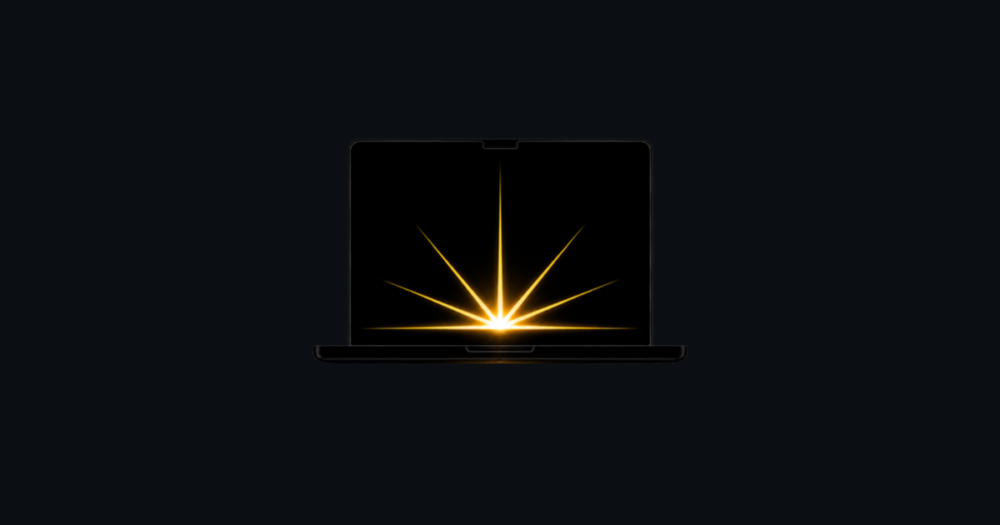

  

<h1 align="center">MaxCandela</h1>

<strong>Your MacBook Pro screen can go far brighter than macOS lets it. MaxCandela unlocks it.</strong>

  <a href="https://maxcandela.com">maxcandela.com</a>

---

Your MacBook Pro's XDR display is rated for around **1,000 nits** of brightness —
but for everyday content, macOS caps it near **600**. The rest is reserved for
HDR video and normally sits unused. MaxCandela hands that reserve back to you.

One click, and your whole screen steps up to the brightness your hardware always
had — brighter for working in sunlight, on a bright desk, or any time 600 nits
just isn't enough.

## Two ways to use it

**🖥️ The Mac app** — a single ☀️ button in your menu bar. Click to boost your
entire screen (every app, every window); click again to go back. That's the
whole thing.

**🌐 The website** — visit **[maxcandela.com](https://maxcandela.com)** and press
**Try the boost** to see the effect right in your browser, no install needed.
(The web demo brightens the site's own pages; the Mac app brightens everything.)

## Why people like it

- **Your whole Mac, brighter** — not just one window or one app.
- **One menu, no setup** — click the ☀️ in your menu bar to turn the boost on
  or off. No settings, no sliders, nothing to calibrate.
- **True colors** — a color-calibrated boost that keeps your display's profile
  intact. Brighter, never washed out.
- **Panel-safe** — it never pushes past the limits macOS itself allows for HDR,
  and it automatically eases off when your Mac runs hot.
- **Private** — no accounts, no screen recording. The app never sees what's on
  your screen; it only makes it brighter. Anonymous usage statistics only, as
  described in the [privacy policy](https://maxcandela.com/privacy/).
- **Instantly reversible** — turn it off, or just quit, and your display returns
  to exactly where it was.

## Will it work on my Mac?

You need a display with HDR headroom to unlock:

- **MacBook Pro 14″ / 16″** with an M1 Pro / M1 Max chip or newer (2021 and
  later), with the Liquid Retina XDR display
- **Pro Display XDR**

On those, MaxCandela can reach roughly 1,000 nits instead of the usual ~600.
Some other HDR displays have smaller amounts of headroom and work to varying
degrees.

**MacBook Air, iMac, and standard external monitors are not supported** — they
have no reserve brightness to release, no matter how new the chip is. (An M3
MacBook Air can't be boosted; a 2021 MacBook Pro can.) On those Macs MaxCandela
tells you so instead of pretending to work. You can check your own display for
free at [maxcandela.com](https://maxcandela.com) before buying — if the browser
demo doesn't brighten your screen, the app won't either.

Requires macOS 15.6 or later.

## Pricing

Free to download with a **5-day trial**, fully unlocked. After that:

- **$9.99** once — yours for life, or
- **$0.99 / month**

One purchase covers every Mac on your Apple ID.

## A note on heat & battery

More brightness uses more power and generates more heat — that's physics, the
same as playing HDR video. MaxCandela watches your Mac's thermal state and looks
after your machine automatically: it eases the boost down as things get warm,
and if the Mac gets genuinely hot it will briefly **dim the screen below normal**
to help it cool — then restores everything once the temperature drops. Turn it
off any time to go back to normal.

## Links

- 🌐 Website — [maxcandela.com](https://maxcandela.com)
- 🔒 [Privacy Policy](https://maxcandela.com/privacy/)
- 📄 [Terms of Use](https://maxcandela.com/terms/)
- 💬 [Support](https://maxcandela.com/support/)

## License

MIT — see [LICENSE](./LICENSE).

## Disclaimer

MaxCandela is an independent project and is not affiliated with, endorsed by, or
sponsored by Apple Inc. "MacBook Pro", "Liquid Retina XDR", and "Pro Display
XDR" are trademarks of Apple Inc. Use at your own risk.
